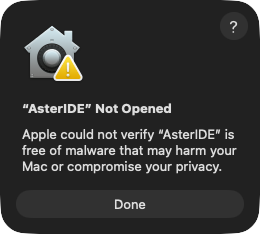
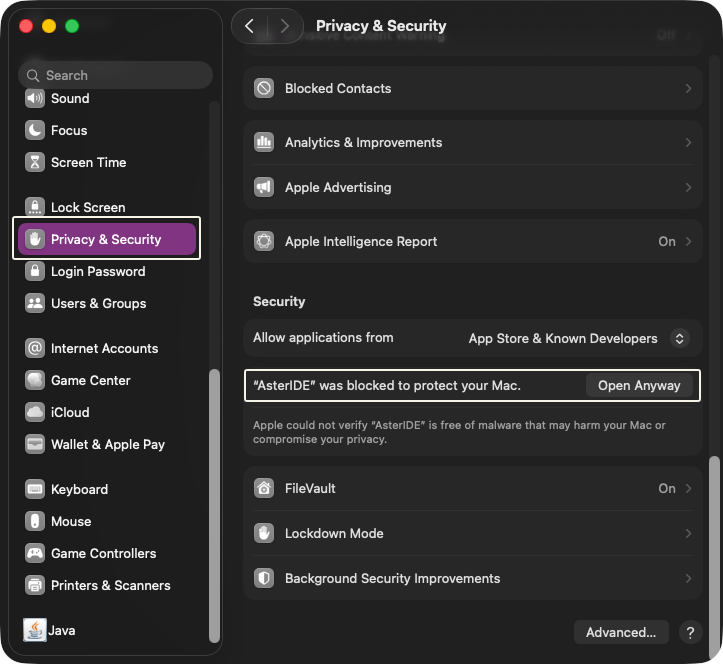
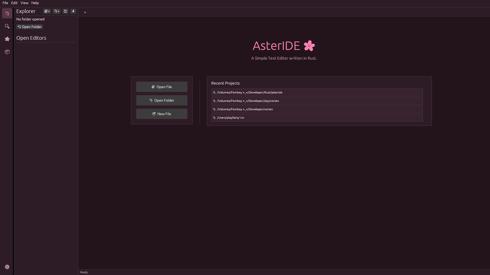
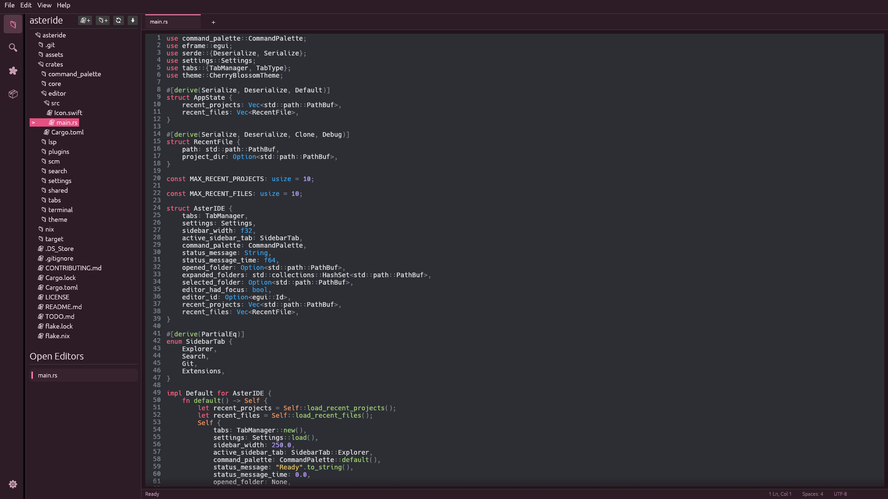
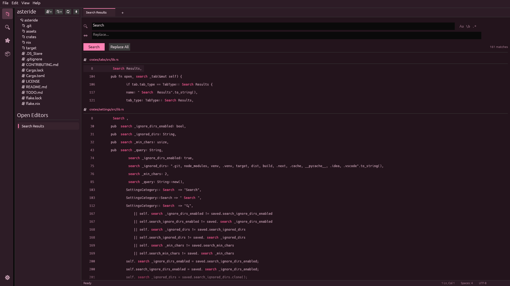
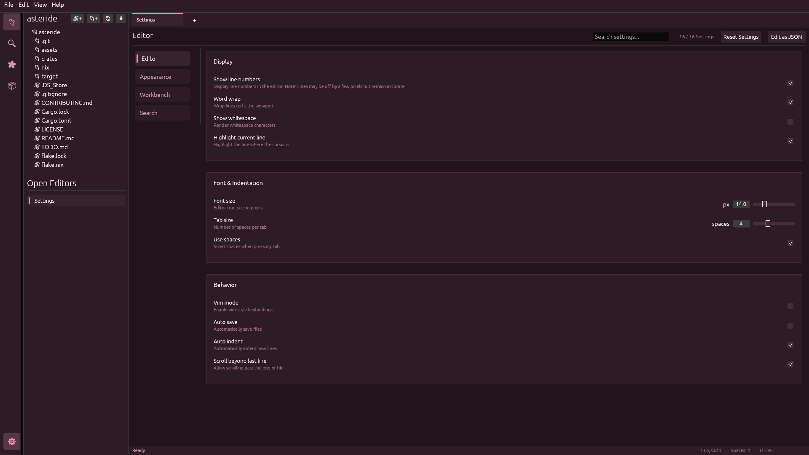
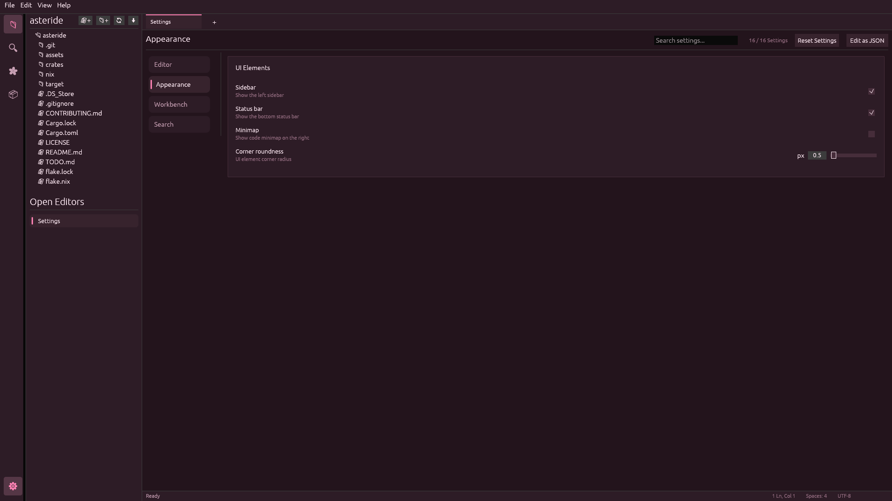
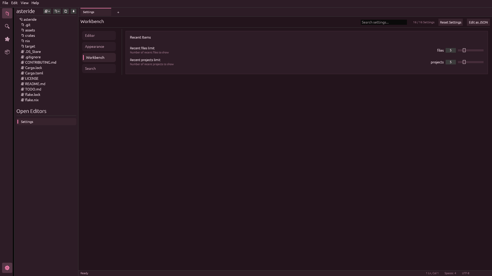
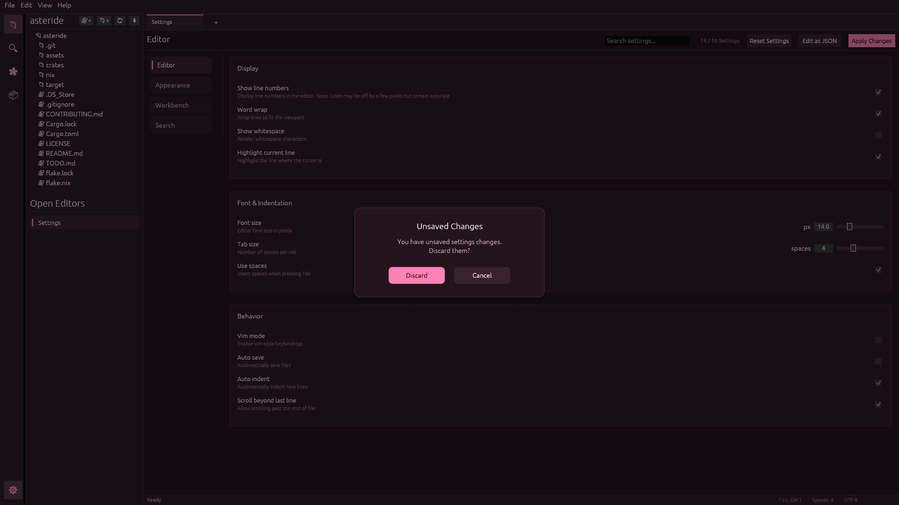

# AsterIDE 🌸

**A Simple Text Editor** written in **Rust**, made for Femboys 🌸

---

## Why AsterIDE?

I made AsterIDE as a fun side Project with one thing in mind, to make a silly Text Editor, based on the image below.


>[!NOTE]
> AsterIDE will **NOT** look like the image above, it simply a meme / joke with some friends, it is not what the IDE will look like, but it will be based on it.

## Installation

### macOS

<details>
<summary>Apple could not verify "AsterIDE" is free of Malware that may harm your Mac or compromise your privacy.</summary>



Image of subject warning

Becasue we don't have $100/A$150 dollars to spend to become a recognized developer for Apple-
especially for a side project, this application is not (and will not be) signed.

To bypass this Gatekeeper mechanism to run this app unsigned, you have to follow steps below

- Open System Settings (formerly System Preferences) 
- Privacy & Security
- Scroll all the way to the bottom
- Re open up the app
- Select "Open anyways"



if this doesn't help you, (e.g you cant follow steps as the prompts not showing)
there might be some X-Attributes stuck on the app which needs to be wiped for Gatekeeper to be happy.
To do so you can run this command, substituting with the app.

```sh
  xattr -c <location-to-.app-file>
```

</details>

## Screenshots












---
Written in **Rust** with ❤️ by **Playfairs**.
